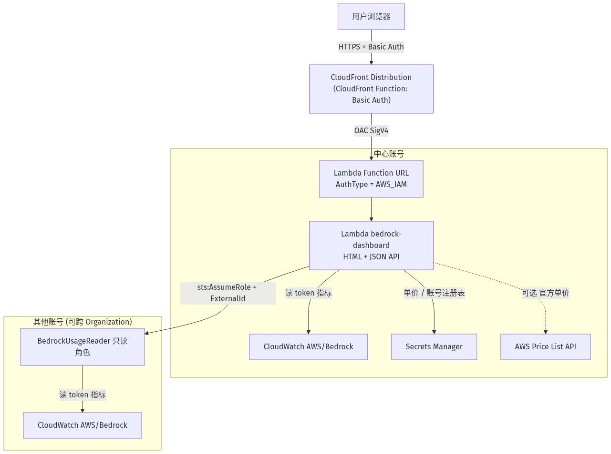
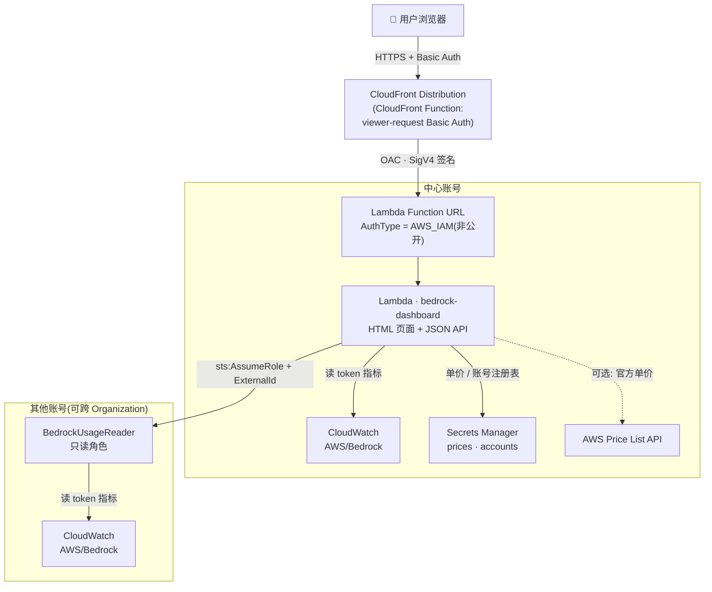

# Bedrock Usage Dashboard

一个**极简、serverless、跨账号(跨 Org)**的 Amazon Bedrock token 用量与成本估算看板。基于 CloudWatch `AWS/Bedrock` 指标,单个 Lambda 同时提供 API 和炫酷的前端页面,通过 CloudFront 公网访问(HTTPS、不暴露源站 IP),并带 Basic Auth 登录鉴权。

> ⚠️ **金额均为估算值,非真实账单。** 基于 CloudWatch token 用量 × 可配置单价推算。精确对账请以 AWS Cost Explorer / CUR 为准(单价、Batch 折扣、Provisioned Throughput、1M 上下文溢价等会造成差异)。

---

## ✨ 功能

- **📊 用量与成本估算** — 按模型展示 输入 / 输出 / 缓存读 / 缓存写 token,套单价算出估算成本
- **🌍 区域与 global** — 单区域查询,或 `global` 跨所有已启用区域并发聚合(适配 `global.*` 跨区推理配置)
- **🏢 多账号 / 跨 Org** — 中心 Lambda 通过 AssumeRole 读取其他账号的 CloudWatch;页面一键生成接入命令,粘到目标账号即纳管。**不依赖同一个 AWS Organization**
- **⚙️ 单价可配置** — 单价存于 Secrets Manager,页面可视化编辑;支持「从 AWS Price List API 拉取」官方价
- **🔎 三形态模型区分** — 直连模型 ID / 系统跨区 profile(`us.`/`global.`)/ application inference profile 在表格中清晰区分;app profile 自动反查显示 `名字 (底层模型)` 并匹配单价
- **🔔 分账告警(钉钉)** — 只有 application inference profile 支持成本分配标签;EventBridge 定时(默认 6h)扫描,发现**直连模型 ID / 系统 profile 的用量**(无法分账)即推送钉钉 webhook(支持加签),页面可视化配置
- **📅 UTC 对齐账单** — 按 UTC 天聚合,与 AWS 出账口径一致;支持日期范围与「千 token」账单口径单位切换
- **🔐 登录鉴权** — CloudFront Function 实现 Basic Auth,边缘拦截,保护全站
- **🧩 极简架构** — 单 Lambda + Function URL + CloudFront,无 S3 / 无 API Gateway / 无数据库

## 🏗 架构



<details>
<summary>Mermaid 源(可编辑)</summary>



</details>


| 组件 | 作用 |
|------|------|
| **Lambda** (`bedrock-dashboard`) | 同时出 HTML 页面 + JSON API;查 CloudWatch、算成本、assume 跨账号 |
| **Function URL** (AWS_IAM) | Lambda 入口,仅 CloudFront 可经 OAC 调用 |
| **CloudFront** + **OAC** | 全球边缘、HTTPS、隐藏源站;OAC 用 SigV4 锁定源站 |
| **CloudFront Function** | viewer-request 阶段做 HTTP Basic Auth |
| **Secrets Manager** | `bedrock-dashboard/prices`(单价)、`bedrock-dashboard/accounts`(账号注册表) |
| **BedrockUsageReader** | 部署在**每个被纳管账号**的只读角色(`onboard-account.yaml`) |

## 🚀 一键部署

前置:已配置 AWS 凭证(需 aws cli v2 + python3)。**所有资源由 CloudFormation 栈统一管理**(便于变更/卸载,也不会被各类"资源清理"工具误删散装资源):

```bash
git clone https://github.com/CrypticDriver/bedrock-usage-dashboard.git
cd bedrock-usage-dashboard

DASH_PASS='你的登录密码' ./deploy.sh
```

脚本会自动:建部署桶(`cfn-deploy-<账号>-<区域>`)→ `cloudformation package` 上传代码 → 部署/更新栈 → 打印看板地址。

可选环境变量:

| 变量 | 默认 | 说明 |
|------|------|------|
| `REGION` | `us-west-2` | 部署区域 |
| `STACK` | `bedrock-dashboard` | 栈名 |
| `DASH_USER` / `DASH_PASS` | `admin` / — | 登录账密(首次必填 `DASH_PASS`,更新时省略=沿用) |
| `ALERT_RATE` | `rate(6 hours)` | 分账告警定时频率,如 `rate(12 hours)` |

- **更新**:改完代码再跑一遍 `./deploy.sh` 即可(密码不用重给)。
- **卸载**:`./destroy.sh`(删整个栈,CloudFront 禁用+删除全自动)。
- 不想用脚本?`template.yaml` 就是标准 SAM 模板,`sam deploy --guided` 或手动 `package`+`deploy` 均可。
- 首次 CloudFront 分发约需 5–10 分钟,完成后用设置的用户名/密码登录。

## 🏢 接入其他账号(跨 Org)

1. 打开看板 → **⚙️ 配置 → 多账号接入** → 点 **🎲 生成接入命令**
2. 把生成的命令复制到**目标账号**的终端运行(自动创建 `BedrockUsageReader` 只读角色,打印 role ARN)
3. 把 role ARN + 账号 ID 填回页面(ExternalId 已自动带入)→ **➕ 添加账号**
4. 顶部「账号」下拉选中该账号即可查看其用量

> 偏好 IaC 的团队可用 `onboard-account.yaml`(CloudFormation,支持 StackSets 批量纳管),参数填 ExternalId 与中心角色 ARN。

安全:跨账号信任使用 **ExternalId** 防混淆代理;`BedrockUsageReader` 仅含 `cloudwatch:GetMetricData/ListMetrics`、`bedrock:ListInferenceProfiles/GetInferenceProfile` 只读权限。

## 🔧 单价配置

- **⚙️ 配置 → 单价配置**:卡片式编辑每个家族/模型的单价(USD / 1M tokens),保存写入 Secrets Manager(约 1 分钟全量生效)
- **🔄 从 AWS 定价 API 拉取**:调用 `pricing:GetProducts` 拉官方价作为参考(仅覆盖 AWS 已发布的模型)
- 匹配优先级:完整 ModelId 精确 > 家族关键字(opus/sonnet/haiku/fable/nova)

## 🔔 分账告警(钉钉)

**场景**:只有 **application inference profile** 支持成本分配标签。一旦有人直接用模型 ID 或系统跨区 profile(`us.*` / `global.*`)调用,这部分费用就无法按业务分账——很多客户对此零容忍。

- 打开看板 → **⚙️ 配置 → 🔔 分账告警**:填钉钉机器人 webhook(安全设置建议「加签」,或自定义关键词含 `Bedrock`)、检查窗口(6/12/24h)、区域,勾选「启用」保存
- **EventBridge 定时触发**(部署参数 `ALERT_RATE` 可调):窗口内发现不可分账用量 → 推送 markdown 告警(模型、token 量、估算金额、整改建议)
- **🧪 立即检查并推送**:异步后台执行(全区域扫描约 1 分钟),结果直接推钉钉
- 配置存于 Secrets Manager `<栈名>/alerts`

## 🩶 运行时"灰区"统计(看板内置面板)

被限流(429)、客户端 4xx、推理前失败的请求**不计 token、不计费**。会"悄悄计费"的是**失败请求里已被处理的 token**:输入只要被模型读入就计费;输出为**流式中途失败**已产出的部分。

看板主页「**🩶 运行时灰区**」面板基于 **Model Invocation Logging** 日志精确统计这部分(日志条目含 `errorCode` 与 token 数,**灰区 = errorCode 存在**;无需 CloudTrail):面板里选区域、填日志组(默认 `br_invocation_loggroup`)、用当前「账号/日期」查询,显示失败已计费的输入/输出 token 及按模型+错误类型的明细。

**启用(可选,按区域一次性配置)** —— 核心部署不会动账号的日志配置,需要灰区时单独跑:

```bash
./enable-invocation-logging.sh us-west-2            # 仅元数据(token/errorCode),隐私优先
./enable-invocation-logging.sh us-east-1 --with-text # 同时记录 prompt/响应正文
```

默认**只记元数据不记正文**(灰区统计只需 token 数与 errorCode)。该配置是账号+区域级、不可回溯、会覆盖该区已有日志配置。

> ⚠️ 仅 **bedrock-runtime** 端点:Model Invocation Logging 不记录 `bedrock-mantle`(Responses API)。区域不能选 `global`(日志按区存储)。

## 📈 直接调用 API(可选)

所有请求需 Basic Auth。

| 请求 | 说明 |
|------|------|
| `GET /` | HTML 看板 |
| `GET /?format=json&region=&start=&end=&account=` | 各模型用量+成本(估算) |
| `GET /?format=accounts` | 已注册账号列表 |
| `GET /?format=prices` | 当前单价 |
| `GET /?format=gray&region=&loggroup=&account=` | 失败请求计费 token(运行时灰区) |

时间:`start`/`end` 为 `YYYY-MM-DD`(UTC);或用 `days=30`。`region` 可填具体区或 `global`。

## 🔐 安全说明

- 全站经 CloudFront Function Basic Auth 保护;Function URL 为 `AWS_IAM`,仅 CloudFront 经 OAC 可调
- Basic Auth 为单一共享凭证、简单门禁;如需个人化登录/SSO/审计,可换用 Amazon Cognito 或 IAM Identity Center
- 修改登录密码:重跑 `deploy.sh`(会更新 CloudFront Function),或更新 `bedrock-dash-basicauth` 函数代码后 publish

## 💰 成本

CloudFront、Lambda、Secrets Manager 在此类低流量场景下成本极低(多数月份接近 AWS 免费额度)。CloudWatch `GetMetricData` 按调用计费,`global` 跨区会增加调用量。

## ⚠️ 估算误差来源

单价是否准确(最大因素)· Batch 五折 · Provisioned Throughput(按小时,不适用 token 估算)· 1M 上下文溢价 · 缓存写 5min/1h 分档 · 计费口径与指标口径差异。**对账以 Cost Explorer / CUR 为准。**

## 📄 License

MIT
