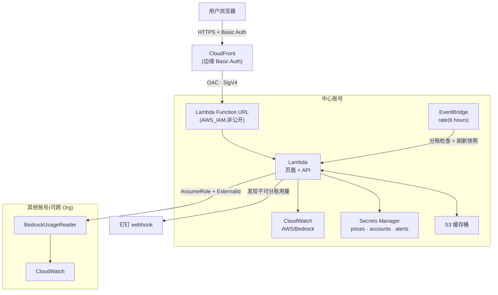

# Bedrock Usage Dashboard

极简、serverless、可跨账号的 **Amazon Bedrock 用量 & 成本估算看板**。单个 Lambda 同时提供 JSON API 和暗色主题页面,经 CloudFront 分发、Basic Auth 登录,一条命令部署。

> ⚠️ 金额为**估算值**(CloudWatch token 用量 × 可配置单价),精确对账以 Cost Explorer / CUR 为准。

## ✨ 功能

| 能力 | 说明 |
|------|------|
| 📊 用量与成本 | 按模型展示输入 / 输出 / 缓存读写 token 与估算成本;按 UTC 天聚合,对齐账单口径 |
| 🏷️ 分账视角 | 类型列区分**模型 ID / 系统跨区 profile / 应用推理 profile**(绿 = 可按标签分账);悬停任意行即显完整 ARN / ModelId |
| 🔔 分账告警 | 发现无法分账的用量(未走 app inference profile)→ 推送**钉钉 webhook**(可加签);EventBridge 定时检查,页面可视化配置;支持忽略清单 + 按窗口节流防重复轰炸 |
| 📸 快照秒开 | 定时任务把 7 天 global 数据快照到 S3,页面打开约 0.3s 出数;点「查询估算」才实时扫描 |
| 🌍 区域 & global | 单区域查询,或跨全部已启用区域并发聚合;默认查近 7 天 |
| 🏢 多账号 / 跨 Org | AssumeRole + ExternalId 纳管其他账号,页面一键生成接入命令,**不要求同一 Organization** |
| ⚙️ 单价可配置 | 存于 Secrets Manager,页面卡片式编辑,支持从 AWS Price List API 拉取官方价 |
| 🧰 可选运维面板 | 错误监控 / 运行时灰区统计默认隐藏,`OPS_PANELS=true ./deploy.sh` 开启 |

## 🏗 架构


| 组件 | 作用 |
|------|------|
| Lambda | HTML 页面 + JSON API;查 CloudWatch、算成本、assume 跨账号 |
| Function URL + CloudFront(OAC) | HTTPS 全球分发,源站不公开(AWS_IAM + SigV4) |
| CloudFront Function | 边缘 Basic Auth |
| Secrets Manager | `…/prices` 单价 · `…/accounts` 账号注册表 · `…/alerts` 告警配置 |
| EventBridge Rule | 定时(默认 6h):分账检查 + 刷新快照 |
| S3 缓存桶 | 私有,7 天生命周期,存 global 快照 |
| BedrockUsageReader | 部署在被纳管账号的只读角色(`onboard-account.yaml`) |

<details>
<summary>Mermaid 源</summary>



</details>

## 🚀 快速开始

前置:aws cli v2 + 已配置凭证。所有资源由 CloudFormation 栈统一管理。

```bash
git clone https://github.com/CrypticDriver/bedrock-usage-dashboard.git
cd bedrock-usage-dashboard
DASH_PASS='你的登录密码' ./deploy.sh
```

首次部署约 5–10 分钟(CloudFront 分发较慢),完成后打印看板地址,用 `admin` / 你的密码登录。

| 环境变量 | 默认 | 说明 |
|----------|------|------|
| `REGION` / `STACK` | `us-west-2` / `bedrock-dashboard` | 部署区域 / 栈名 |
| `DASH_USER` / `DASH_PASS` | `admin` / — | 登录账密(仅首次必填密码) |
| `ALERT_RATE` | `rate(6 hours)` | 告警定时频率 |
| `OPS_PANELS` | `false` | 开启运维面板 |

**更新**:`git pull && ./deploy.sh` —— 密码沿用、栈增量更新,单价/账号/告警配置存于 Secrets **不会丢**。版本看页脚,变更见 [CHANGELOG.md](CHANGELOG.md),可 `git checkout v1.1.0` 锁版本。

**卸载**:`./destroy.sh`(自动清空缓存桶、删栈、清理 secrets 残留)。

**改密码**:`DASH_PASS='新密码' ./deploy.sh`。

## 📖 使用

**多账号接入** — 看板 ⚙️ 配置 → 多账号接入 → 🎲 生成接入命令 → 粘到目标账号终端运行 → 把打印的 role ARN 填回页面。偏好 IaC 用 `onboard-account.yaml`(支持 StackSets)。跨账号角色仅含 CloudWatch / Bedrock 只读权限,ExternalId 防混淆代理。

**分账告警** — ⚙️ 配置 → 🔔 分账告警:填钉钉机器人 webhook(安全设置建议「加签」,或关键词含 `Bedrock`)、窗口(6/12/24h)、可选忽略清单(每行一个 id,支持前缀通配 `global.*`)、勾「启用」保存;🧪 可立即触发一次(异步,结果推钉钉,不受节流限制)。原理:只有 **application inference profile** 支持成本分配标签,窗口内出现模型 ID / 系统 profile 的用量即告警。扫描每 6h 一次(`ALERT_RATE` 可调),但**推送按所选窗口节流**——同一窗口只推一条,选 12/24h 不会重复告警同一笔用量。

**单价** — ⚙️ 配置 → 单价配置,卡片式编辑(USD/1M tokens);匹配优先级:完整 ModelId > 家族关键字(opus/sonnet/haiku/fable/nova)。

**灰区统计(可选,需 `OPS_PANELS=true`)** — 统计失败请求中已计费的 token(输入被读入即计费、流式中途失败已产出的输出)。需按区域开启 Model Invocation Logging:`./enable-invocation-logging.sh <region>`(默认只记元数据;`--with-text` 才记正文;仅 bedrock-runtime,区域不能选 global)。

## 📈 API

均需 Basic Auth。时间参数 `start`/`end`(YYYY-MM-DD, UTC)或 `days=7`;`region` 为具体区域或 `global`。

| 请求 | 说明 |
|------|------|
| `GET /?format=json&region=&days=` | 各模型用量 + 估算成本 |
| `GET /?format=json&region=global&cached=1` | 优先返回 S3 快照(秒回,含 `cached_at`) |
| `GET /?format=series&model=&region=` | 单模型按天趋势 |
| `GET /?format=prices` / `?format=accounts` / `?format=alerts` | 单价 / 账号 / 告警配置 |
| `GET /?action=test_alert` | 手动触发告警检查(异步) |
| `GET /?format=gray&region=&loggroup=` | 灰区统计(需开 invocation logging) |

## 🔐 安全 & 💰 成本

- 全站边缘 Basic Auth;Function URL 仅 CloudFront 可调;跨账号只读 + ExternalId
- Basic Auth 为共享凭证的简单门禁,需个人化登录可换 Cognito / IAM Identity Center
- 典型用量(每天打开数次)**约 $2/月**:Secrets Manager 固定 $1.2 + 其余合计 <$1;`AWS/Bedrock` 指标本身免费,只付 GetMetricData 查询费;灰区若开启日志另计($0.50/GB 摄入)

**估算误差来源**:单价准确性(最大因素)· Batch 五折 · Provisioned Throughput · 1M 上下文溢价 · 缓存写分档。对账以 Cost Explorer / CUR 为准。

## 📄 License

MIT
