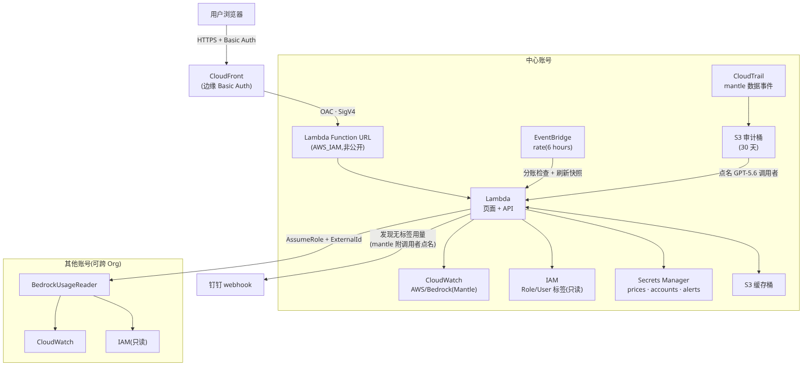
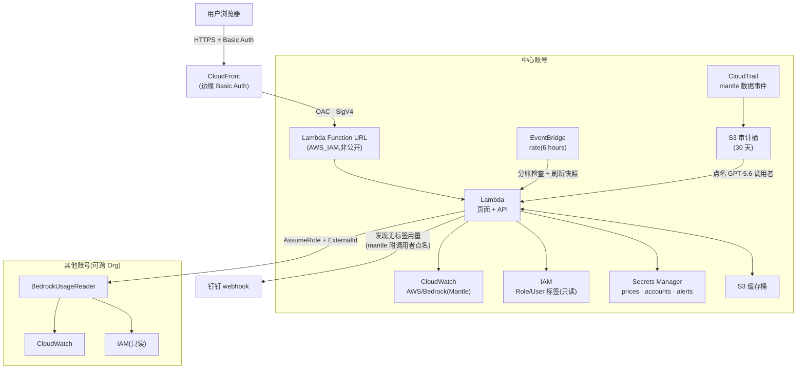

# Bedrock Usage Dashboard

极简、serverless、可跨账号的 **Amazon Bedrock 用量 & 成本估算看板**。单个 Lambda 同时提供 JSON API 和暗色主题页面,经 CloudFront 分发、Basic Auth 登录,一条命令部署。

> ⚠️ 金额为**估算值**(CloudWatch token 用量 × 可配置单价),精确对账以 Cost Explorer / CUR 为准。

## ✨ 功能

| 能力 | 说明 |
|------|------|
| 📊 用量与成本 | 按模型展示输入 / 输出 / 缓存读写 token 与估算成本;按 UTC 天聚合,对齐账单口径 |
| 🤖 GPT-5.6 纳管 | 覆盖走 Responses API(`bedrock-mantle` 端点)的 GPT-5.6 Sol/Terra/Luna,并按 **Bedrock Project** 拆分归集(该端点不支持成本分配标签) |
| 💰 真实账单 | Cost Explorer 拉 Amazon Bedrock Service 账单行(UnblendedCost,非估算),跨账号一账号一行:总费用 / map-migrated 已打标 / 未打标 / 占比 |
| 🔑 IAM Principal 打标 | 扫出**有 Bedrock 调用权限的 IAM Role / User**,显示各自 `map-migrated` 打标状态(已打标 / 无效打标 / 未打标)与权限来源,未打标行直接给出可复制的 `aws iam tag-role` 修复命令 —— 对应 MAP 推荐的 **IAM principal tagging**(无需建 inference profile、无需改代码);支持账号下拉、按打标状态筛选与分页 |
| 🏷️ 分账视角 | 类型列区分**模型 ID / 系统跨区 profile / 应用推理 profile**(绿 = 可按资源标签分账);悬停任意行即显完整 ARN / ModelId |
| 🔔 分账告警 | 发现无法按标签归属的用量 → 推送**钉钉 webhook**(可加签),**一条消息覆盖 runtime 与 mantle 两端**;app inference profile 会核查**实际打标状态**(建了没打标照样报,附 `tag-resource` 修复命令);已用 IAM principal 打标时自动降级为巡检不误报;EventBridge 定时检查,页面可视化配置;支持忽略清单 + 按窗口节流防重复轰炸 |
| 🔍 GPT-5.6 调用归因 | 可选**审计 trail**(默认开,$0.10/10万次调用,CloudTrail 数据事件):分账告警对 mantle 用量直接**点名真实调用者**(身份/次数/模型/是否 API key 调用)并附打标修复命令;审计确认调用者全部已打标则不算违规 |
| 📸 快照秒开 | 定时任务把 7 天 global 数据与 IAM principal 打标状态快照到 S3,页面打开约 0.3s 出数;点「查询估算」才实时扫描 |
| 🌍 区域 & global | 单区域查询,或跨全部已启用区域并发聚合;默认查近 7 天 |
| 🏢 多账号 / 跨 Org | AssumeRole + ExternalId 纳管其他账号,页面一键生成接入命令,**不要求同一 Organization** |
| ⚙️ 单价可配置 | 存于 Secrets Manager,页面卡片式编辑,支持从 AWS Price List API 拉取官方价 |
| 🧰 可选运维面板 | 错误监控 / 运行时灰区统计默认隐藏,`OPS_PANELS=true ./deploy.sh` 开启 |

## 🏗 架构



| 组件 | 作用 |
|------|------|
| Lambda | HTML 页面 + JSON API;查 CloudWatch、算成本、assume 跨账号 |
| Function URL + CloudFront(OAC) | HTTPS 全球分发,源站不公开(AWS_IAM + SigV4) |
| CloudFront Function | 边缘 Basic Auth |
| Secrets Manager | `…/prices` 单价 · `…/accounts` 账号注册表 · `…/alerts` 告警配置 |
| EventBridge Rule | 定时(默认 6h):分账检查 + 刷新快照 |
| S3 缓存桶 | 私有,7 天生命周期,存 global 快照与 IAM principal 打标快照 |
| CloudTrail 审计 trail + S3 审计桶(可选,默认开) | 只记 mantle 数据事件(`AWS::BedrockMantle::Project`,$0.10/10万次调用),30 天生命周期;分账告警据此点名 GPT-5.6 真实调用者。**不录管理事件** —— 账号已有组织/安全 trail 的,不会因多这条 trail 产生管理事件付费副本($2/10万条那项与它无关)。`MANTLE_AUDIT=false ./deploy.sh` 关闭 |
| BedrockUsageReader | 部署在被纳管账号的只读角色(`onboard-account.yaml`);角色名支持 `BedrockUsageReader*` 后缀,同一账号可被多个看板纳管 |

<details>
<summary>Mermaid 源</summary>


```mermaid
flowchart TD
  U["用户浏览器"] -->|"HTTPS + Basic Auth"| CF["CloudFront<br/>(边缘 Basic Auth)"]
  CF -->|"OAC · SigV4"| FURL["Lambda Function URL<br/>(AWS_IAM,非公开)"]
  subgraph CENTRAL["中心账号"]
    FURL --> L["Lambda<br/>页面 + API"]
    EB["EventBridge<br/>rate(6 hours)"] -->|"分账检查 + 刷新快照"| L
    L --> CW["CloudWatch<br/>AWS/Bedrock(Mantle)"]
    L --> IAM["IAM<br/>Role/User 标签(只读)"]
    L --> SM["Secrets Manager<br/>prices · accounts · alerts"]
    L <--> S3["S3 缓存桶"]
    CT["CloudTrail<br/>mantle 数据事件"] --> AS3["S3 审计桶<br/>(30 天)"]
    AS3 -->|"点名 GPT-5.6 调用者"| L
  end
  L -->|"发现无标签用量<br/>(mantle 附调用者点名)"| DT["钉钉 webhook"]
  L -->|"AssumeRole + ExternalId"| RR
  subgraph ORG["其他账号(可跨 Org)"]
    RR["BedrockUsageReader"] --> CW2["CloudWatch"]
    RR --> IAM2["IAM(只读)"]
  end
```

</details>

## 🚀 快速开始

前置:aws cli v2 + 已配置凭证。所有资源由 CloudFormation 栈统一管理。

```bash
git clone https://github.com/CrypticDriver/bedrock-usage-dashboard.git
cd bedrock-usage-dashboard
DASH_PASS='你的登录密码' ./deploy.sh
```

首次部署约 5–10 分钟(CloudFront 分发较慢),完成后打印看板地址,用 `admin` / 你的密码登录。

| 环境变量 | 默认 | 说明 |
|----------|------|------|
| `REGION` / `STACK` | `us-west-2` / `bedrock-dashboard` | 部署区域 / 栈名 |
| `DASH_USER` / `DASH_PASS` | `admin` / — | 登录账密(仅首次必填密码) |
| `ALERT_RATE` | `rate(6 hours)` | 告警定时频率 |
| `OPS_PANELS` | `false` | 开启运维面板 |

**更新**:`git pull && ./deploy.sh` —— 密码沿用、栈增量更新,单价/账号/告警配置存于 Secrets **不会丢**。版本看页脚,变更见 [CHANGELOG.md](CHANGELOG.md),可 `git checkout v1.1.0` 锁版本。

> ⬆️ **从任意旧版本可直接升级到最新版,无需逐版本升级** —— 合并版步骤见 [docs/UPGRADE.md](docs/UPGRADE.md)。

> ⬆️ **升到 1.8.0(IAM Principal 打标面板)有一处需手工介入**:成员账号的 `BedrockUsageReader` 角色需补 IAM **只读**权限,否则该账号在新面板显示"权限不足"(用量与账单统计不受影响)。不阻塞升级 —— 详见 [docs/UPGRADE-1.8.0.md](docs/UPGRADE-1.8.0.md)。

> ⬆️ **升到 1.7.0(GPT-5.6 纳管)有两处需手工介入**:成员账号补 `bedrock-mantle` 只读权限、单价表补 GPT-5.6 三条(单价存于 Secrets 会整表覆盖代码内置值,**新装同样需要**,否则成本列显示 UNKNOWN)。不做仅功能降级、不阻塞升级 —— 详见 [docs/UPGRADE-1.7.0.md](docs/UPGRADE-1.7.0.md)。

**卸载**:`./destroy.sh`(自动清空缓存桶、删栈、清理 secrets 残留)。

**改密码**:`DASH_PASS='新密码' ./deploy.sh`。

## 📖 使用

**多账号接入** — 看板 ⚙️ 配置 → 多账号接入 → 🎲 生成接入命令 → 粘到目标账号终端运行 → 把打印的 role ARN 填回页面。偏好 IaC 用 `onboard-account.yaml`(支持 StackSets)。跨账号角色仅含 CloudWatch / Bedrock / Cost Explorer / IAM **只读**权限(无任何 `iam:Tag*` 等写权限),ExternalId 防混淆代理。

**IAM Principal 打标(MAP 推荐分账方式)** — 主页面 → 🔑 IAM Principal 打标。按 [MAP 文档](https://docs.aws.amazon.com/MAP/latest/userguide/bedrock-map-tagging.html),**2026-06-08 起**给调用 Bedrock / AgentCore 的 IAM Role 或 User 打 `map-migrated` 标签即可分账,**无需创建 application inference profile、无需改应用代码**。面板扫出有 Bedrock 调用权限的 Role/User,逐个显示打标状态,未打标行直接给可复制的 `aws iam tag-role|tag-user` 命令;期望标签值在「真实账单」面板设置,值不一致(多敲空格 / 大小写不符)单列为**无效打标**。principal 多时可用**账号下拉**切换(一次只看一个账号,不堆叠)、**按打标状态筛选**(只看未打标)并**分页**(默认每页 10,可切 25/50/100/全部),三者均为纯前端操作、不重新扫描 IAM。

> ⚠️ **两种打标方式只应选一种** —— 若同时存在 application inference profile 的**资源标签**与 IAM principal 标签,**资源标签优先级更高**。另:MAP 迁移开始前就在用的角色,其支出会被排除在 MAP spend 之外。
>
> 判定基于**静态策略解析**(内联 + 托管 + 用户所属组),**不求解 Deny / 权限边界 / SCP / Condition**;仅靠 `Action:"*"` 命中的会标注**宽泛授权**需人工确认;服务关联角色不可打标故跳过。宁可多列也不漏,请以实际调用方为准。

**分账告警** — ⚙️ 配置 → 🔔 分账告警:填钉钉机器人 webhook(安全设置建议「加签」,或关键词含 `Bedrock`)、窗口(6/12/24h)、可选忽略清单(每行一个 id,支持前缀通配 `global.*`)、勾「启用」保存;🧪 可立即触发一次(异步,结果推钉钉,不受节流限制)。原理:只有 **application inference profile** 支持**资源**成本分配标签,窗口内出现模型 ID / 系统 profile 的用量即告警;但若看板检测到已有打标的 IAM principal,则**降级为巡检消息不告警**(金额仍如实列出),避免对已合规用量误报。扫描每 6h 一次(`ALERT_RATE` 可调),但**推送按所选窗口节流**——同一窗口只推一条,选 12/24h 不会重复告警同一笔用量。

**单价** — ⚙️ 配置 → 单价配置,卡片式编辑(USD/1M tokens);匹配优先级:完整 ModelId > 家族关键字(opus/sonnet/haiku/fable/nova/gpt-5.6-sol/terra/luna)。

**灰区统计(可选,需 `OPS_PANELS=true`)** — 统计失败请求中已计费的 token(输入被读入即计费、流式中途失败已产出的输出)。需按区域开启 Model Invocation Logging:`./enable-invocation-logging.sh <region>`(默认只记元数据;`--with-text` 才记正文;仅 bedrock-runtime,区域不能选 global)。

**Claude Code Skill** — 仓库自带 [.claude/skills/bedrock-monitor](.claude/skills/bedrock-monitor/SKILL.md),在仓库目录里运行 Claude Code 即自动可用,直接问"Bedrock 花了多少钱 / 打标占比多少"即可。首次使用需配置连接信息(找部署者要地址和账密):

```bash
cat > ~/.bedrock-dash.env <<'EOF'
BEDROCK_DASH_URL='https://xxxxxxxxxx.cloudfront.net'
BEDROCK_DASH_AUTH='admin:密码'
EOF
chmod 600 ~/.bedrock-dash.env
```

想在任意目录使用,把 skill 拷到个人目录:`cp -r .claude/skills/bedrock-monitor ~/.claude/skills/`。

## 📈 API

均需 Basic Auth。时间参数 `start`/`end`(YYYY-MM-DD, UTC)或 `days=7`;`region` 为具体区域或 `global`。

| 请求 | 说明 |
|------|------|
| `GET /?format=json&region=&days=` | 各模型用量 + 估算成本 |
| `GET /?format=json&region=global&cached=1` | 优先返回 S3 快照(秒回,含 `cached_at`) |
| `GET /?format=series&model=&region=` | 单模型按天趋势 |
| `GET /?format=cecost&days=` | Cost Explorer 真实账单 + map-migrated 打标占比(跨账号) |
| `GET /?format=principals[&cached=1][&limit=]` | 有 Bedrock 调用权限的 IAM Role/User 及其 map-migrated 打标状态(跨账号;`cached=1` 读快照,`limit` 调扫描上限,默认 1500 角色 / 500 用户) |
| `GET /?action=scan_principals` | 触发**后台异步**全量 IAM 扫描并立即返回(同步路径受网关 60s 限制扫不全);进行中重复调用会去重 |
| `GET /?format=principals_job` | 后台扫描进度:`state`(none/running/done/failed)、`cache_written`;`running` 超 15 分钟自动视为失败 |
| `GET /?format=prices` / `?format=accounts` / `?format=alerts` / `?format=settings` | 单价 / 账号 / 告警 / 看板设置(含期望标签值) |
| `GET /?action=test_alert` | 手动触发告警检查(异步) |
| `GET /?format=errors&region=` | 每模型错误率 / 限流(基于 CloudWatch 指标) |
| `GET /?format=gray&region=&loggroup=` | 灰区统计(需开 invocation logging) |

## 🔐 安全 & 💰 成本

- 全站边缘 Basic Auth;Function URL 仅 CloudFront 可调;跨账号只读 + ExternalId
- IAM 相关权限**全部只读**(`List*` / `Get*`),不含 `iam:Tag*` 等任何写权限 —— 看板只检测打标状态并生成修复命令,打标动作始终由使用者自己执行
- Basic Auth 为共享凭证的简单门禁,需个人化登录可换 Cognito / IAM Identity Center
- 典型用量(每天打开数次)**约 $2/月**:Secrets Manager 固定 $1.2 + 其余合计 <$1;`AWS/Bedrock` 指标本身免费,只付 GetMetricData 查询费;灰区若开启日志另计($0.50/GB 摄入)

**估算误差来源**:单价准确性(最大因素)· Batch 五折 · Provisioned Throughput · 1M 上下文溢价 · 缓存写分档。对账以 Cost Explorer / CUR 为准。

## 📄 License

MIT
